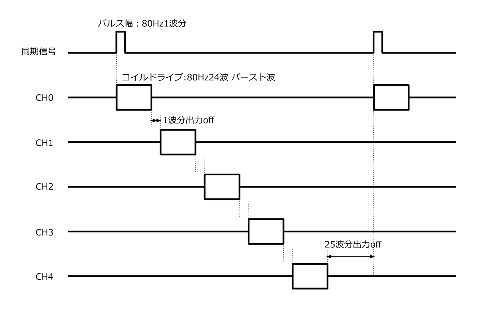
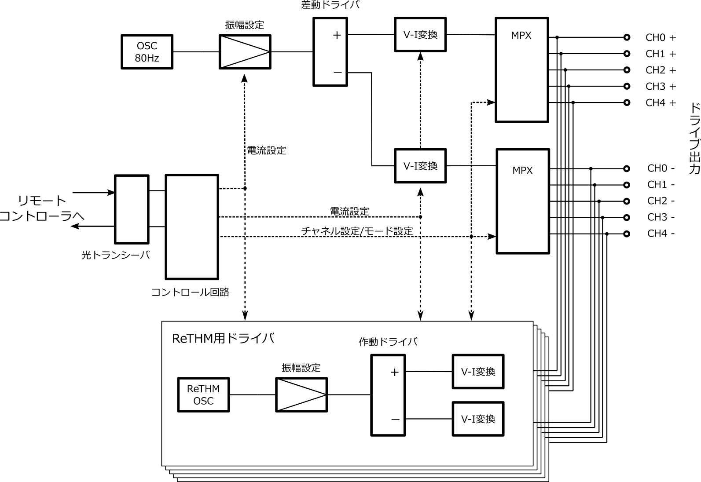
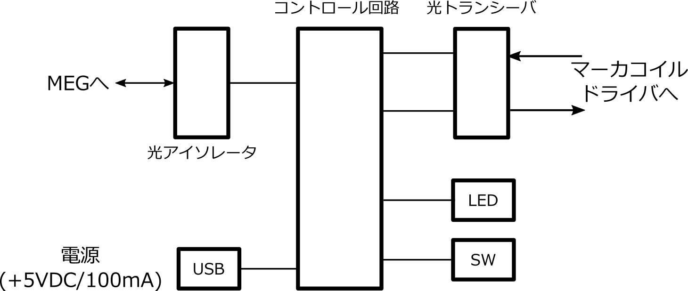
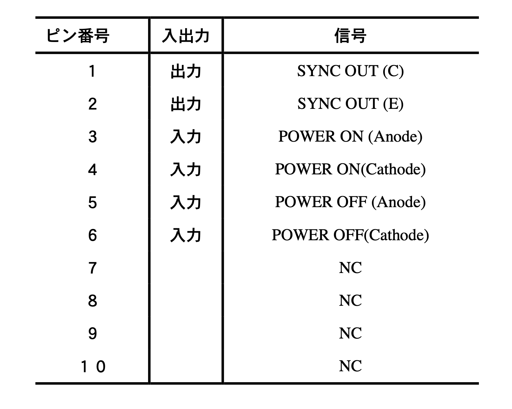
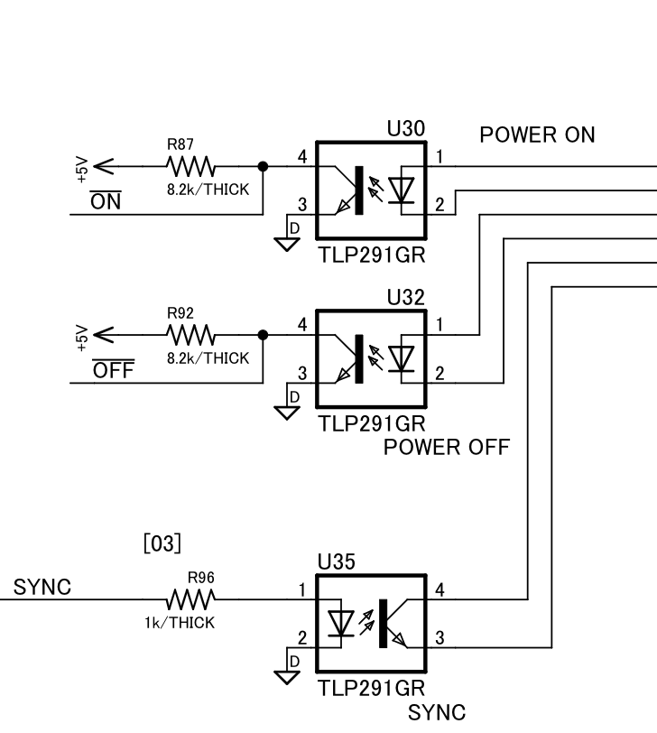

# 機器名
## マーカコイルドライバ　EM-80D, EM-80R

# 機器の概要
マーカコイルドライバは、MEG計測において被験者の頭部位置情報を計測するために必要となる信号を発生するための回路です。  
MEG装置内部での被験者の頭部位置を推定するために、複数の小型のコイル（マーカコイルと呼びます）を被験者の頭部に取り付け、そのコイルを既知の周波数の信号で駆動することによりコイルの周囲に磁場を発生させその磁場をMEGで計測します。この回路はそのコイルを駆動するために設計された回路です。

# 構成 
この装置は、コイル駆動を行う（型式：EM-80D）とそれをコントロールするためのリモコン（型式：EM-80R）の2つの筐体に入った回路で構成されています。  
コイル駆動回路は、MEG計測への電磁的影響を最小限にするためバッテリ（単３ｘ４）で駆動するように設計されています。また、リモコンはMEG装置と接続され、MEG装置からのコイル駆動動作のOn/Off操作を受け付けたり、MEG装置へコイルの駆動タイミング情報を送る役割を果たします。  
両者はプラスティック光ファイバで接続され、シールドルーム外からの電磁的なノイズ流入を最小限に抑えます。  
マーカコイルそのものについては、この設計情報に含まれません。

コイルの駆動電流は：

コイル駆動回路とリモコンの間の信号は：
パルス幅変調で、リモコン→コイル駆動回路への信号は電源のOn/Off、コイル駆動回路→リモコンへの信号はコイル駆動のタイミング動機信号となっています。

# 仕様
## EM-80D　マーカコイルドライバ （本体）
- ドライブコイル数：5
   
- 駆動電流 　(リアパネルスイッチによる　4点切り替え)
  - 5/10/50/100μAo-p 	（80Hzモード）
  - 3/6/10/20μAo-p　	（ReTHMモード）

- 駆動モード （スタンバイモード/80Hzモード/ReTHMモード）
  - 80Hzモード
    - 駆動波形：24波のバースト波による順次駆動（図１参照）
    - 駆動周波数：80Hz(typ)
  
  - ReTHMモード
    - 駆動波形：連続波
    - 駆動周波数  
    CH0	20kHz  
    CH1	18kHz  
    CH2	16kHz  
    CH3	14kHz  
    CH4	12kHz
  
  - スタンバイモード
    （コイル駆動なし）

- 駆動モード切替  
    リモートコントローラEM-80Rからの信号による（光ファイバ経由）

- インターフェイス  
  プラスティック光ファイバ2本による（EM-80Rとの接続専用）
  - 入力信号：動作モード切替
  - 出力信号：同期信号（80Hzモード時のみ）

- 操作：フロントパネルトグルスイッチによる電源のOn/Off

- 表示：電源電圧低下警告 Low-Battery（LED:赤）

- 電源：単三充電池（Ni-MH）4本

## EM-80R　リモートコントローラ
- 操作
  - フロントパネルトグルスイッチによる駆動モードの変更
  - 外部インターフェイスからの信号による駆動モードの変更

- 表示：LED（緑）によるEM-80Dの駆動モード表示  
    　消灯　　スタンバイモード  
    　点滅　　80Hzモード  
    　点灯　　ReTHMモード  

- 外部（MEG装置）インターフェイス
  - 入力2bit（on命令、off命令　各1bit）
  - 出力1bit（同期信号）
  - コネクタ型式：HR10G-10R-10P（ヒロセ）（ピンアサインは図３参照）

- 電源	+5V、100mA以下（microUSBコネクタによる）

## 動作に必要なもの
- 単三充電池（Ni-MH）4本
- EM-80D ~ EM-80R間接続用光ファイバケーブル
- EM-80R用電源　USB電源 (5V) と USB-microケーブル（パソコンのUSB端子でも可）

## コイル駆動のタイミングチャート
<!--  -->

## ブロック図
### EM-80D

### EM-80R

## MEG接続用コネクタ　ピン配置
- コネクタ型番：HR10G-10R-10P73（回路側：レセプタクル）

### MEG接続用コネクタのフォトカプラ周辺回路

